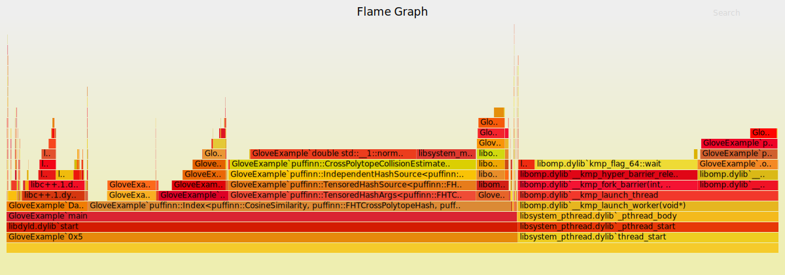
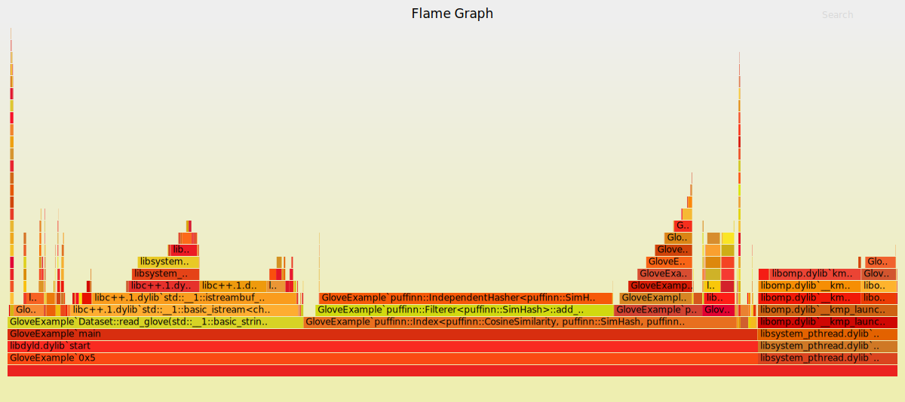

# Microbenchmarks

These microbenchmarks rely on the [`nanobench`](https://nanobench.ankerl.com/) framework, and are implemented in the `bench/bench.cpp` file.
The goal is to inspect the behavior of different components, so to set a baseline for optimization.

All of the following tests have been run on the first 10000 vectors of the [`glove.twitter.25B`](https://nlp.stanford.edu/data/glove.twitter.27B.zip) dataset, with 100 dimensions.
The times reported are obtained on a Macbook Pro (Intel(R) Core(TM) i5-7360U CPU @ 2.30GHz), with code compiled with Clang 10.0.1.

## Some observations
Based on the benchmarks below

- Sketching is not parallilized, but might be rather easily given that it's embarassingly parallel
- Sorting could be done using radix sort: to sort keys of 24 bytes using 8-bit keys we need only 3 passes on the data.
- For cross polytope, every invocation gets you 8 bits, so to get to 24 bits you make three invocations.
But, when using tensoring, only 12 bits are required on each side, meaning, that we need 4 invocations overall.

## Index construction

We measure the time to insert the data into an emtpy index, and the time to rebuild said index with the newly added data.
Therefore the time to build the prefix maps is the difference between the two.
The index is built so that 600 repetitions are executed.

|               ns/op |                op/s |    err% |     total | ns/vector | Index building
|--------------------:|--------------------:|--------:|----------:|----------:|:---------------
|       12,983,647.00 |               77.02 |    0.5% |      0.14 |         - | `index_insert_data`
|    1,820,142,505.00 |                0.55 |    2.7% |     20.73 |       303 | `SimHash independent`
|      931,095,744.00 |                1.07 |    0.3% |     10.25 |      1862 | `SimHash tensored`
|    5,105,854,966.00 |                0.20 |    1.2% |     57.03 |       850 | `FHT CrossPolytope independent`
|    2,495,368,539.00 |                0.40 |    0.3% |     27.64 |      4990 | `FHT CrossPolytope tensored`

The number of nanoseconds spent per vector are obtained by dividing the total time by the product of number of items and repetitions (i.e. `600*10000`)
for the tensored approach the time is divided by the total number of items and the actual number of repetitions of the inner independent hash source (i.e. `50*10000`).

From the table above, we have that with the tensored approach we spend _more_ time per element than with independent hashes.
To further investigate this behavior,
here are two profiles for the index construction with FHT Cross Polytope, using independent and tensored approaches.

**independent**

**tensored**

From the above profiles (which if clicked are interactive) we see that the code paths are very different between independent and tensored invocations.
In particular, the tensored implementation spends a lot of time (around 38%) in estimating the collision probabilities.
The function estimating probabilities is invoked 334 times both by the tensored approach and the independent approach.

Further instrumenting the code reveals that the sampling of hash functions takes around one second and a half, irrespective of the size of the input.
Therefore, this effect is just due to the input size being rather small.

The table below reports the results of the benchmark on a larger dataset, 100k points from glove.

|               ns/op |                op/s |    err% |     total | sketches | sampling | hashing | Index building
|--------------------:|--------------------:|--------:|----------:|---------:|---------:|--------:|:---------------
|       89,858,735.00 |               11.13 |    0.3% |      1.01 |  -       |      -   |  -      | `index_insert_data`
|   17,366,543,710.00 |                0.06 |    0.7% |    195.62 |    2,979,594,285 |     52,946,855     |   14,054,349,816      | `SimHash independent`
|    9,587,672,281.00 |                0.10 |    1.3% |    106.73 |     2,863,388,001 |    14,152,603      |     6,404,964,113    | `SimHash tensored`
|   37,370,006,695.00 |                0.03 |    0.5% |    424.84 |     2,945,923,994 |     1,460,921,248     |     32,824,801,263    | `FHT CrossPolytope independent`
|   15,136,665,540.00 |                0.07 |    7.6% |    168.78 |      3,182,913,475 |      1,484,623,280              |      8,475,368,707             | :wavy_dash: `FHT CrossPolytope tensored` (Unstable with ~1.0 iters. Increase `minEpochIterations` to e.g. 10)

Now other components start to be more expensive: sorting the prefix maps now accounts for 17% of the time when using the tensoring approach.

On the full Glove dataset, using tensored simhash, building the index takes 64 seconds (1GB size, 38 tables):
- 56 seconds are for computing sketches
- 7 seconds and a half are for computing the hashes and sorting prefix maps

These results are just because we are using few repetitions. 
If we double the memory (hence 2Gb, resulting in 152 tables) we have that the time to build the index is 89 seconds:
- 58 to compute sketches
- 31 seconds to compute hashes, including sorting (which accounts for 20% of the frames)

The image reports the time profile

## Querying the index

Here we test the time it takes to query the index, using three different query vectors and asking for the 10 nearest neighbors with 0.9 guaranteed recall.
Times are in nanoseconds in this table, hence we have that all queries take around one millisecond.

|               ns/op |                op/s |    err% |     total | Index query
|--------------------:|--------------------:|--------:|----------:|:------------
|        1,101,686.88 |              907.70 |    0.4% |      1.33 | `index_query (query 0)`
|        1,139,939.24 |              877.24 |    2.2% |      1.38 | `index_query (query 100)`
|        1,076,122.38 |              929.26 |    0.9% |      1.30 | `index_query (query 1000)`

## Hashing

The code for this benchmark is [here](https://github.com/Cecca/puffinn/blob/3142c5d2c0e101bcfce119cd33d98e7250ab3aa1/bench/bench.cpp#L121-L145).
During index construction the hash function is hidden behind a unique pointer, and the vector to be hashed as well.
This indirection may be expensive, therefore we try also a direct static implementation. 
In all benchmarks we compute 24-bits hashes, with the exeption of the `single` calls that generate 8 bits for cross polytope and 1 for simhash.
Therefore, for cross polytope we would expect times to be three times higher than a single invocation, for simhash 24 times higher.
Again, the times are in nanoseconds.

|               ns/op |                op/s |    err% |     total | Hashing
|--------------------:|--------------------:|--------:|----------:|:--------
|              995.79 |        1,004,225.20 |    1.2% |      0.01 | `Cross polytope (single)`
|            3,073.02 |          325,412.89 |    1.4% |      0.04 | `Cross polytope (indirection)`
|            3,046.00 |          328,299.19 |    0.1% |      0.04 | `Cross polytope (static)`
|              321.03 |        3,114,996.82 |    0.0% |      0.00 | `FHT Cross polytope (single)`
|            1,044.19 |          957,681.46 |    1.0% |      0.01 | `FHT cross polytope (indirection)`
|              934.88 |        1,069,653.37 |    0.1% |      0.01 | `FHT cross polytope (static)`
|                5.03 |      198,865,506.85 |    0.2% |      0.00 | `SimHash (single)`
|              332.74 |        3,005,358.55 |    3.1% |      0.00 | `SimHash (indirection)`
|              260.93 |        3,832,376.04 |    4.8% |      0.00 | `SimHash (static)`
